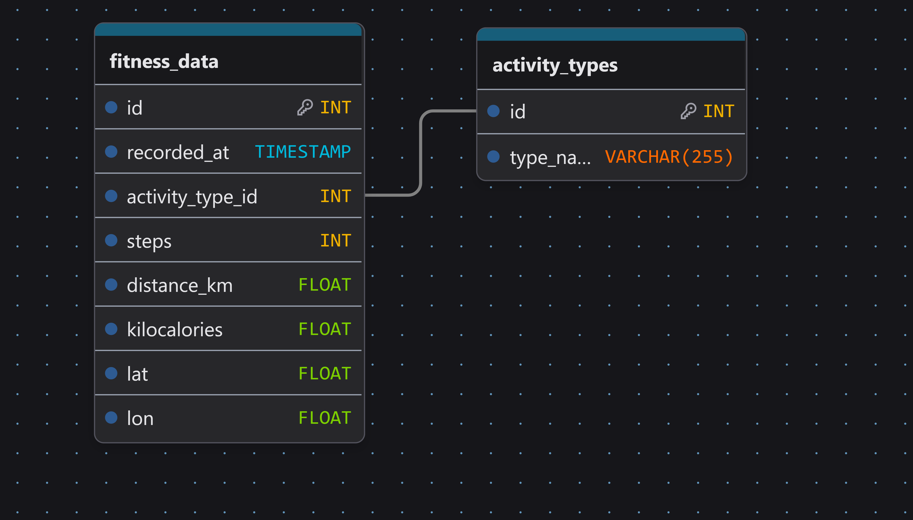
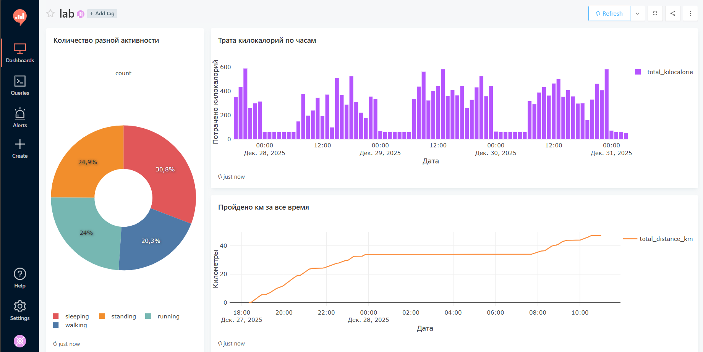
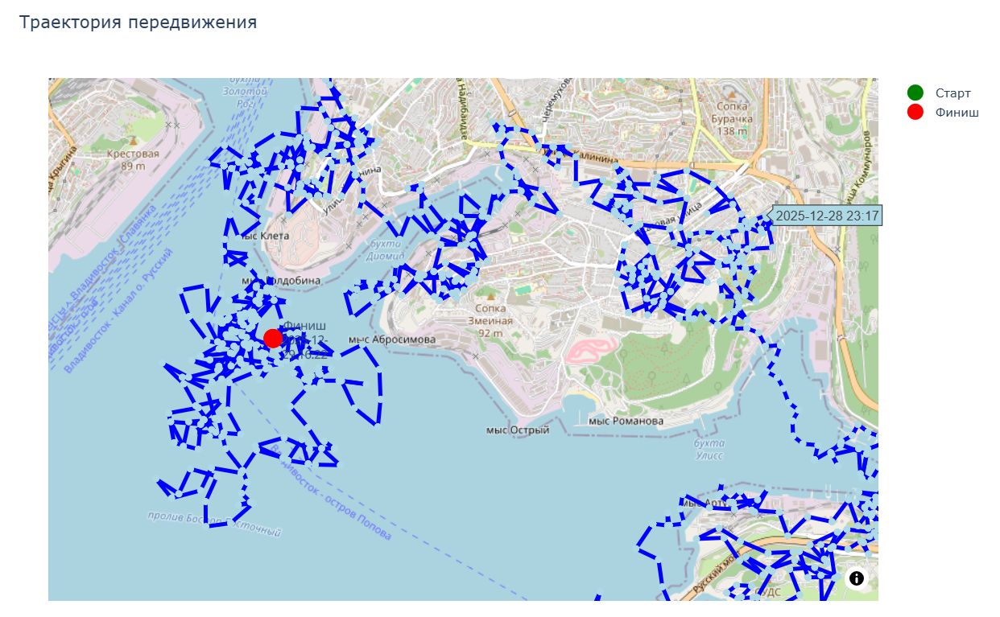
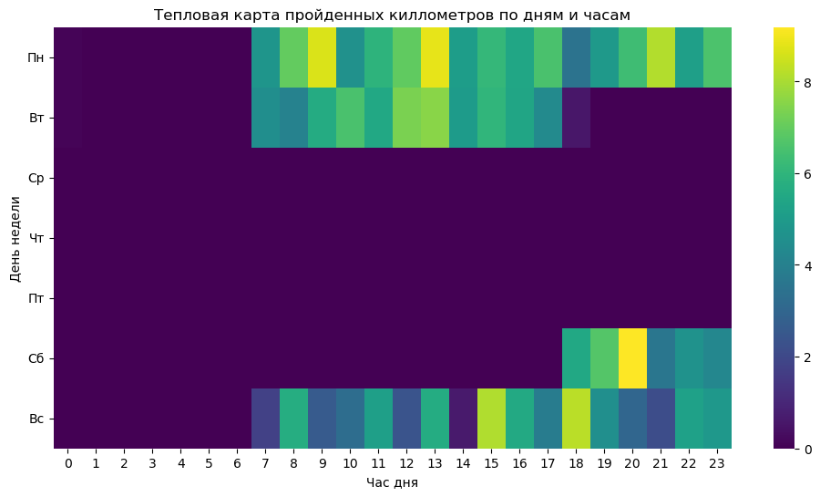
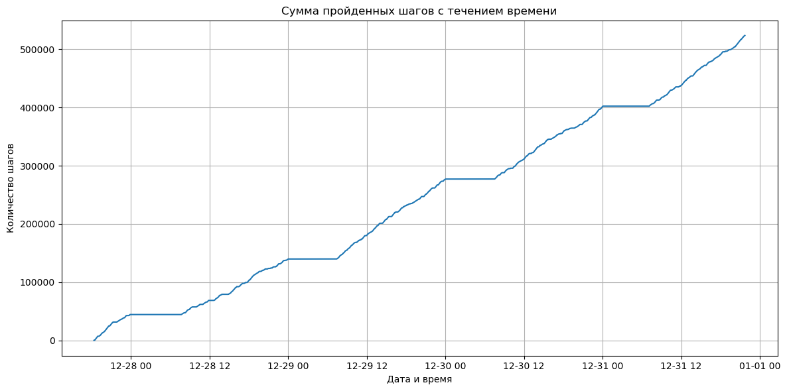

# Лабораторная работа по дисциплине Аналитик данных

## Установка и запуск

### Установка

```cmd
git clone https://github.com/VL1507/data_analysis_fefu.git
```

### Настройка конфига

1. Переименовать файл .env.example в .env
2. Заполнить переменными

Для REDASH_COOKIE_SECRET и REDASH_SECRET_KEY можно использовать openssl

```cmd
openssl rand -hex 32
```

### При первом запуске

```cmd
docker compose run --rm redash-server create_db
```

### Запуск

```cmd
docker compose up
```

## Задание

[Задание](./docs/spec.md)

### Генератор данных

### База данных

PostgreSQL



### Redash

[Запросы](./redash_queries.sql)



### Jupiter Notebook

Хотел сделать в redash, но, как я понял, там нельзя соединять точки линиями







### Осмысленные коммиты

При написании коммитов старался следовать правилам из этих статей:

- [Conventional Commits без лишних слов: ваша шпаргалка](https://habr.com/ru/articles/867012/)
- [Conventional Commits 1.0.0](https://www.conventionalcommits.org/en/v1.0.0/)
